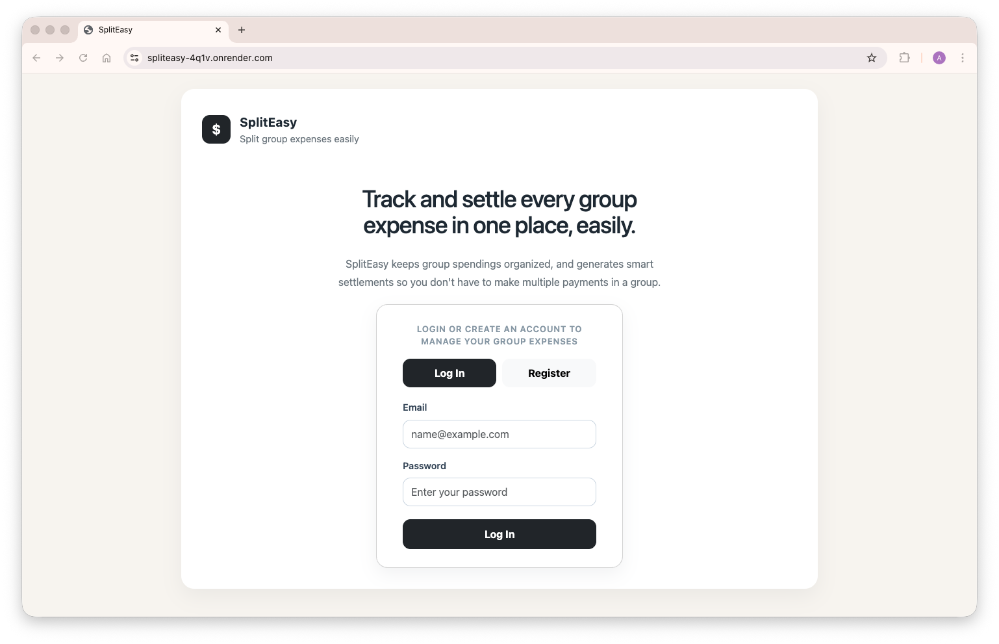
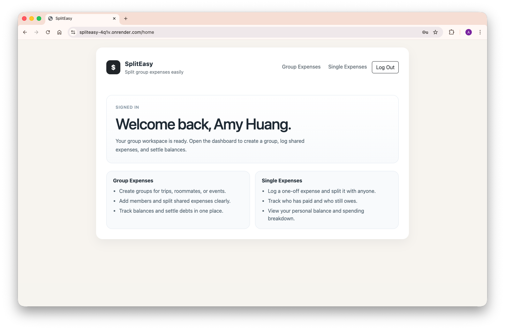
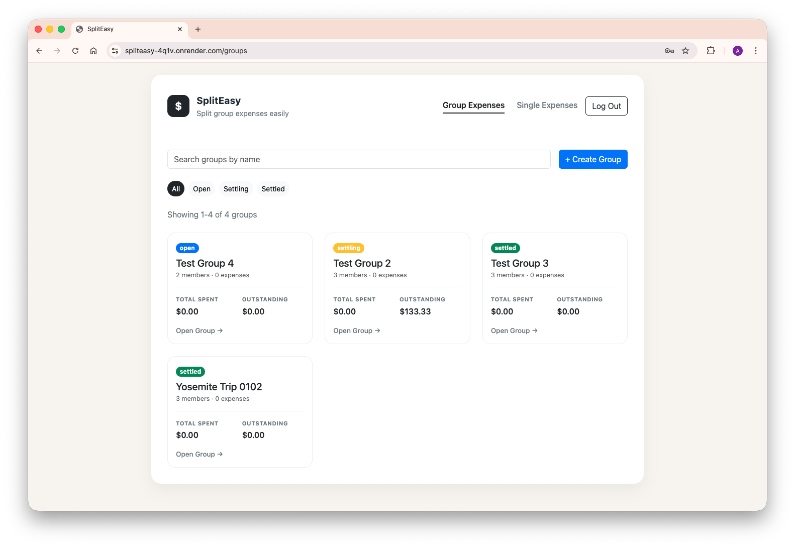
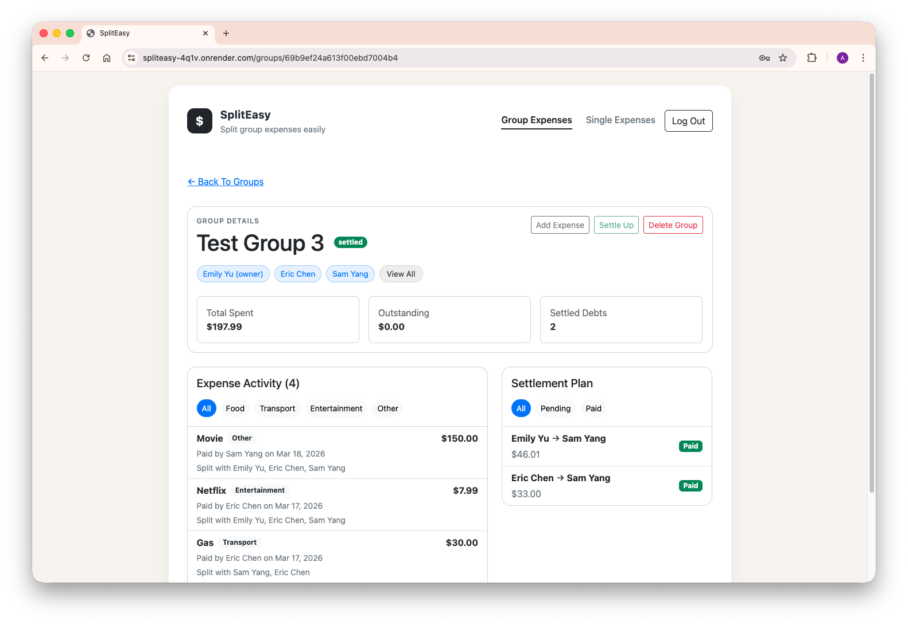
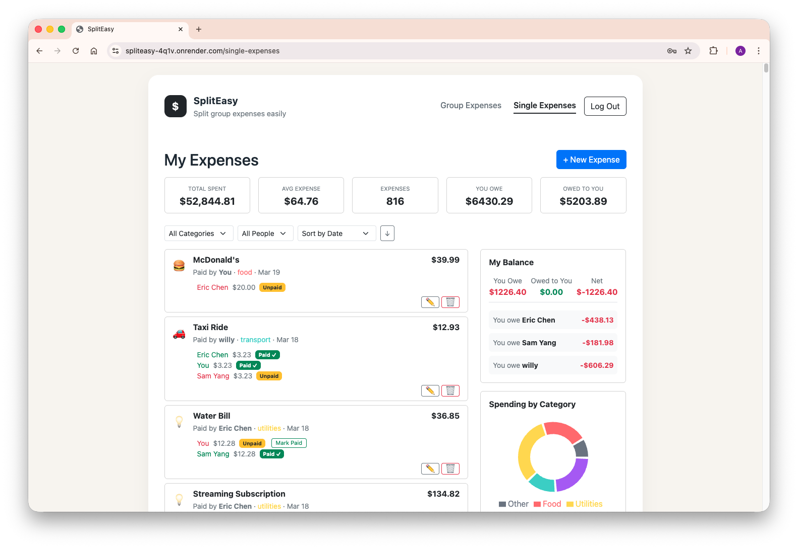
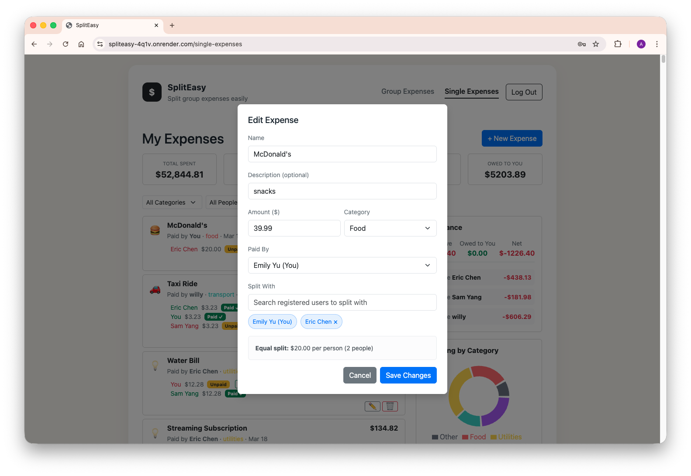

# Smart Expenses Splitter

SplitEasy is a full-stack expense sharing application for roommates, travel groups, and other small groups who need a clearer way to track shared costs. It supports both recurring group workflows and quick one-off expense splits, with balance summaries that show who owes whom.

- Deployment: https://spliteasy-4q1v.onrender.com

## Features

- User registration, login, logout, and session-based authentication

### Group Expenses

Track multiple group expenses in one place for trips, apartments, and events.

- Create a group and invite members by email
- Add shared expenses to a group
- Review members, balances, debts, and expense history in one detail page
- Settle a group to freeze outstanding debts
- Mark settlement debts as paid
- Delete expenses or entire groups with confirmation safeguards

### Single Expenses

Track single expenses in one place for ad hoc splits.

- Create one-off expenses without creating a group
- Filter expenses by category and payer
- Sort expenses by date, amount, or category
- View quick stats, balance summaries, and category spending charts
- Edit, delete, and mark expenses as paid

## Screenshots

| Landing Page | Home Page |
| --- | --- |
|  |  |
| Group Dashboard | Group Details |
|  |  |
| Single Expenses | Single Expense Details |
|  |  |


## Tech Stack

### Frontend

- React + Vite
- React Router
- React Bootstrap
- Recharts
- `passport-local`

### Backend

- Node.js
- Express
- MongoDB

## Project Structure

```text
smart-expenses-splitter/
├── README.md
├── LICENSE
├── design/
│   ├── DESIGN.md
│   └── mockups/
├── frontend/
│   ├── package.json
│   ├── vite.config.js
│   ├── index.html
│   └── src/
│       ├── components/
│       ├── context/
│       ├── layouts/
│       ├── pages/
│       ├── services/
│       ├── utils/
│       ├── App.jsx
│       └── index.jsx
└── backend/
    ├── .env.example
    ├── package.json
    ├── server.js
    ├── config/
    ├── db/
    ├── middleware/
    ├── routes/
    └── utils/
```

## Local Development

### Prerequisites

- Node.js 18 or newer
- npm
- A MongoDB connection string

### Environment Variables

Create `backend/.env` using `backend/.env.example` as the starting point.

Required values:

- `MONGODB_URI`
- `SESSION_SECRET`

Optional values:

- `PORT` default: `3000`
- `DB_NAME` default: `spliteasy`

### Install Dependencies

```bash
cd backend
npm install
cd ../frontend
npm install
```

### Run in Development

In one terminal:

```bash
cd backend
npm run dev
```

In a second terminal:

```bash
cd frontend
npm run dev
```

The frontend runs at [http://localhost:5173](http://localhost:5173).
The backend runs at [http://localhost:3000](http://localhost:3000).
Vite proxies `/api` requests to the backend during local development.

### Build for Production

Build the frontend bundle:

```bash
cd frontend
npm run build
```

Then start the backend server:

```bash
cd backend
npm start
```

The Express server serves the built frontend from `frontend/dist`.

## Available Scripts

### Frontend

- `npm run dev`: start the Vite development server
- `npm run build`: create a production build
- `npm run preview`: preview the built frontend locally
- `npm run lint`: run ESLint
- `npm run format`: run Prettier on `src/`

### Backend

- `npm start`: start the Express server
- `npm run dev`: start the backend with Nodemon
- `npm run lint`: run ESLint
- `npm run format`: run Prettier

---

_This project was developed for CS 5610 Web Development at Northeastern University (Oakland)._

- Authors: Pangta Huang, Amy Huang
- Course page: [johnguerra.co/classes/webDevelopment_online_spring_2026](https://johnguerra.co/classes/webDevelopment_online_spring_2026/)
