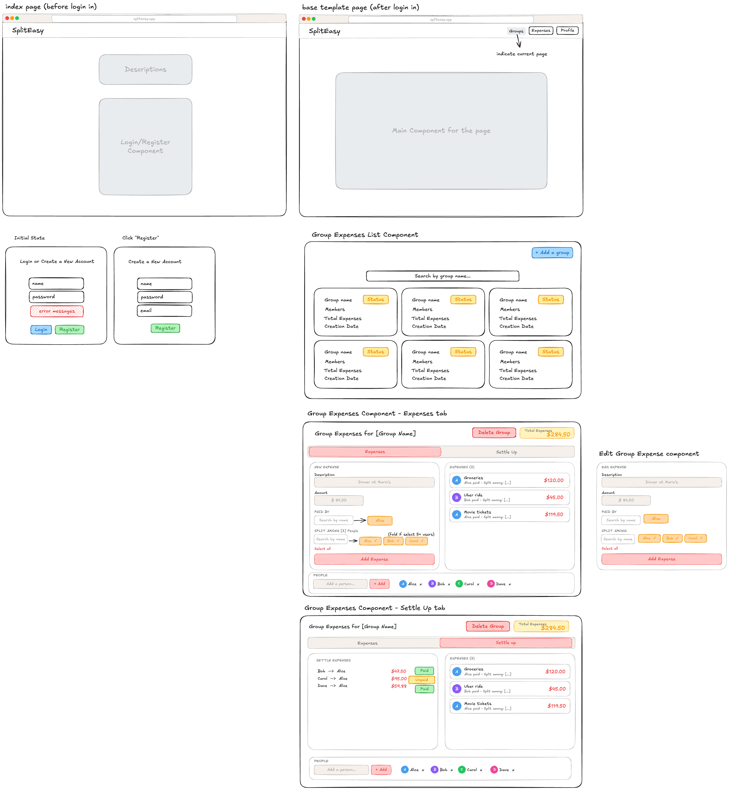

## Project Description

When roommates share an apartment or friends go on a group trip, splitting bills for groceries, utilities, and dinners can quickly become messy and confusing. People often forget who paid for what, leading to awkward conversations or unfair distribution of costs. Keeping a manual spreadsheet is tedious and hard to maintain on the go.
SplitEasy solves this problem by providing a simple, centralized platform where users can create shared groups, add friends, log expenses, and visualize spending patterns. The app keeps a running total of who owes whom and automatically calculates the simplest way to settle up, ensuring everyone pays their fair share without the hassle. Users can also search and filter expense history, view spending breakdowns through interactive charts, and mark debts as settled — all in one place.


## User Persona

- **The Roommate (Alex)**: A college student living with three other roommates. He wants an easy way to split shared costs like rent, WiFi, and groceries that are paid by different people so that he can just send his payments to one or two people, rather than sending multiple payments to everyone who has paid a bill. He also appreciates seeing a clear balance summary at a glance so he knows exactly who owes what.

- **The Trip Organizer (Sarah)**: Frequently travels with a group of friends. She needs a quick way to log expenses (like a dinner bill or an Uber ride) while on the trip, and wants to settle all balances at the end of the vacation. She values being able to filter expenses by category and date to get a clear picture of what the group spent the most on.

- **The Casual User (David)**: Just went out for drinks with a colleague and paid the whole tab. Needs a simple interface to log a one-off expense split without navigating through complex group settings. He wants to quickly record a "Quick Split" expense, see the breakdown, and move on.


## User Stories

### Groups & Group Expenses Management (MongoDB Collections: Groups)
- Create: As a user, I want to create a new group (e.g., "Miami Trip 2026") by filling in a group name and adding members through a form modal, so we can keep our shared expenses organized in one place.
- Create: As a group member, I want to add an expense that I have paid for, including the details such as item name, amount, group members to split with.
- Read: As a user, I want to view a dashboard listing all the groups I am a part of, with a summary card for each group showing the group name, members, total group spending, and a balance status indicator, so I can quickly see which groups need attention. I also want to search and filter groups by name using a search bar at the top of the dashboard.
- Read: As a group member, I want to view the expenses submitted by other group members and who are involved in those expenses.
- Update: As a group creator, I want to click an "Edit" button on a group card to open an edit modal where I can rename the group, add new members, or remove existing members if someone leaves the group.
- Update: As a group member, I want to mark the settled expenses as “Paid” when I made my payment.
- Delete: As a group owner, I want to click a "Delete" button on a group card to remove a group I no longer need. If there are still unsettled balances, the app will show a confirmation warning dialog asking me to confirm before proceeding, so I don't accidentally lose important data.
- Delete: As a group member, I want to delete unsettled expenses I added by mistake.

#### Design decisions:
1. Only group owner can add and remove group members.
2. Only group owner can delete the group.
3. Only group owner can settle expenses for a group.
4. Instead of using a separate expenses collection, the expenses of a group is included as a list in the Group collection as it matches the usage pattern better.

### Expenses & Balances Tracker (MongoDB Collections: Expenses)
- Create: As a user, I want to click an "Add Expense" button to open a form modal where I can enter an expense description (e.g., "Dinner at Joe's"), specify the total amount, select a category from a dropdown (food, transport, utilities, entertainment, other), choose a split method (equal split, custom amounts, or percentage-based), and select who paid, so the system can automatically calculate each person's share.
- Read: As a user, I want to see a scrollable feed of all recorded expenses within a specific group, with each expense card showing the payer, amount, category icon, and date. Within this view, I also want to:
    - Use a filter bar to narrow expenses by category, date range, or payer, and sort the feed by date (newest/oldest), amount (highest/lowest), or category.
    - View a Balance Summary panel on the side that automatically calculates and displays who owes whom and the net amount between each pair of members. Each debt row has a "Settle Up" button that I can click to mark that debt as paid, instantly updating the balances.
    - See a Spending Breakdown Chart (pie chart or bar chart using recharts) that visualizes the group's total spending by category, so we can see at a glance where our money went.
    - See Quick Stats at the top of the page showing the group's total spending, average expense amount, and the single biggest expense.
- Update: As a user, I want to click an "Edit" icon on any expense card to reopen the form modal pre-filled with the current data, so I can correct the amount, change the category, or update the split if I made a mistake when logging the receipt.
- Delete: As a user, I want to click a "Delete" icon on any expense card to remove an expense that was entered by mistake. The app will show a confirmation dialog before deleting to prevent accidental removals.

### User registration and authentication (MongoDB Collection: Users)
- Create: As a user, I want to register a new account so that I can keep track of my expenses and group expenses. 


## Database Design

The application uses **three MongoDB collections**.

## Users

```
{
  _id,
  name: string,
  email: string,
  passwordHash: string,
  groups: [groupId],
  dateCreated: timestamp
}
```

## Groups

```
{
  _id,
  name: string,
  members: [userId],
  owner: userId
  settlements: [
    {
      senderId: userId,
      receiverId: userId,
      amount: float
      isPaid: boolean
    }
  ],
  expenses: [
    {
      _id,
      name,
      description,
      amount,
      category,
      paidBy,
      splitBetween: [userId],
      status: string (paid, unpaid), // for group expense, mark as paid when all group expenses are paid
      dateCreated: timestamp
    }
  ]
  status: string (open, settled), // mark as settled when all the settlements are paid off
  dateCreated: timestamp
}
```

## Mockup
Link: https://excalidraw.com/#room=d0e905ee7d25efadaa40,3_SXWqsJVJVCZQAcikCCQQ


