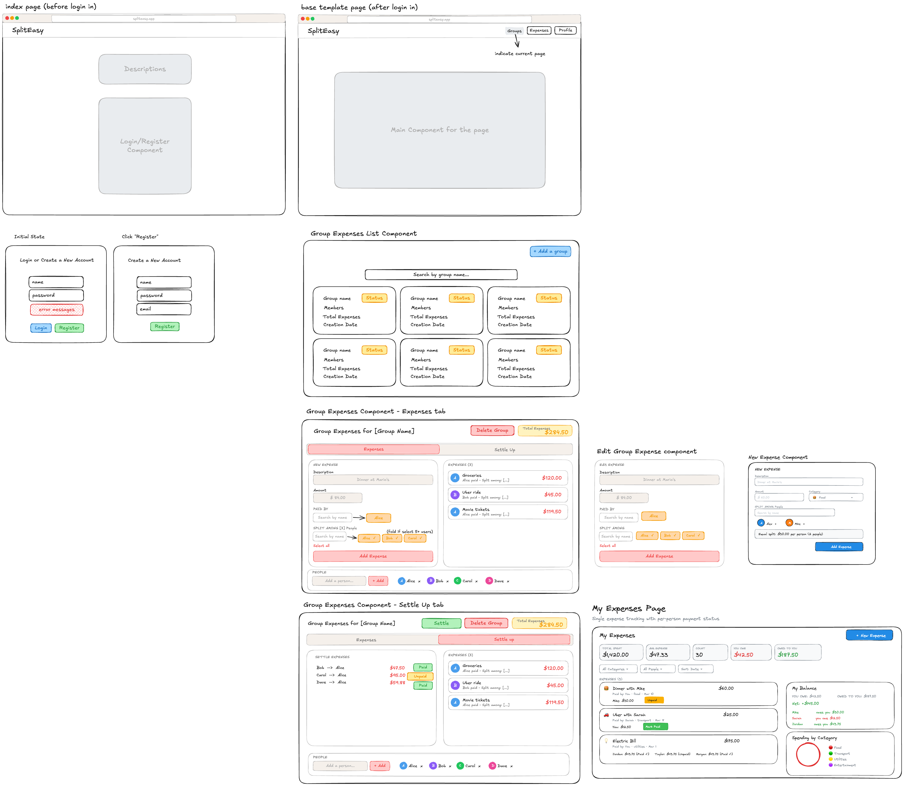

## Project Description

SplitEasy is a shared-expense application for roommates, travel groups, and other small groups that need a simple way to track who paid, who owes, and when a group is fully settled. The product supports two related workflows:

- group expenses for ongoing shared contexts like trips or apartments
- single expenses for quick one-off splits outside a formal group

## Problem Statement

Shared expenses often become hard to manage because payment responsibility is distributed across multiple people and multiple events. Manual spreadsheets and message threads do not give a reliable or current view of balances, which leads to duplicate payments, missed reimbursements, and friction within a group.

SplitEasy addresses this by centralizing:

- expense entry
- member and group tracking
- balance calculation
- settlement state
- personal spending summaries for single expenses

## User Personas

- **Alex, the roommate**: needs a persistent group for apartment bills, groceries, and utilities, with a quick way to see who still owes money.
- **Sarah, the trip organizer**: needs to create a trip group, log expenses as they happen, and settle the full trip at the end.
- **David, the casual user**: needs to record a quick shared expense without first creating a dedicated group.

## User Stories

### Authentication

- As a new user, I want to register an account so I can save my groups and expenses.
- As a returning user, I want to log in and resume where I left off.
- As an authenticated user, I want protected pages to stay inaccessible to unauthenticated visitors.

### Group Expenses

- Create: As a user, I want to create a new group (e.g., "Miami Trip 2026") by filling in a group name and adding members through a form modal, so we can keep our shared expenses organized in one place.
- Create: As a group member, I want to add an expense that I have paid for, including the details such as item name, amount, group members to split with.
- Read: As a user, I want to view a dashboard listing all the groups I am a part of, with a summary card for each group showing the group name, members, total group spending, and a balance status indicator, so I can quickly see which groups need attention. I also want to search and filter groups by name using a search bar at the top of the dashboard.
- Read: As a group member, I want to view the expenses submitted by other group members and who are involved in those expenses.
- Update: As a group creator, I want to click an "Edit" button on a group card to open an edit modal where I can rename the group, add new members, or remove existing members if someone leaves the group.
- Update: As a group member, I want to mark the settlement as “Paid” when I made my payment.
- Delete: As a group owner, I want to click a "Delete" button on a group card to remove a group I no longer need. If there are still unsettled balances, the app will show a confirmation warning dialog asking me to confirm before proceeding, so I don't accidentally lose important data.
- Delete: As a group member, I want to delete unsettled expenses I added by mistake.


### Single Expenses

- Create: As a user, I want to click an "Add Expense" button to open a form modal where I can enter an expense description (e.g., "Dinner at Joe's"), specify the total amount, select a category from a dropdown (food, transport, utilities, entertainment, other), choose a split method (equal split, custom amounts, or percentage-based), and select who paid, so the system can automatically calculate each person's share.
- Read: As a user, I want to see a scrollable feed of all recorded expenses within a specific group, with each expense card showing the payer, amount, category icon, and date. Within this view, I also want to:
    - Use a filter bar to narrow expenses by category, date range, or payer, and sort the feed by date (newest/oldest), amount (highest/lowest), or category.
    - View a Balance Summary panel on the side that automatically calculates and displays who owes whom and the net amount between each pair of members. Each debt row has a "Settle Up" button that I can click to mark that debt as paid, instantly updating the balances.
    - See a Spending Breakdown Chart (pie chart or bar chart using recharts) that visualizes the group's total spending by category, so we can see at a glance where our money went.
    - See Quick Stats at the top of the page showing the group's total spending, average expense amount, and the single biggest expense.
- Update: As a user, I want to click an "Edit" icon on any expense card to reopen the form modal pre-filled with the current data, so I can correct the amount, change the category, or update the split if I made a mistake when logging the receipt.
- Delete: As a user, I want to click a "Delete" icon on any expense card to remove an expense that was entered by mistake. The app will show a confirmation dialog before deleting to prevent accidental removals.

## Typography

The app uses two Google Fonts loaded via `<link>` tags in `index.html`.

### Font assignments

| Context | Font | Rationale |
|---|---|---|
| App body (all pages) | Noto Sans | Neutral, highly legible sans-serif for UI text, labels, and form elements |
| Index page — title & description | Ruluko | Distinct display font that gives the landing page a branded, editorial feel |
| Logo / brand name (AppNavBar) | Ruluko | Ties the navbar brand identity to the landing page's visual tone |

## Mockup



## Information Architecture

### Primary Routes

- `/`: landing page with authentication form
- `/home`: authenticated welcome page
- `/groups`: group dashboard
- `/groups/:groupId`: group detail page
- `/single-expenses`: one-off expense dashboard

### Main Navigation

- Group Expenses
- Single Expenses
- Log Out

## Data Model

The current backend uses MongoDB collections for `users`, `groups`, `groupExpenses`, and `expenses`.

### Users

Used across authentication and group membership.

```js
{
  _id: ObjectId,
  name: string,
  email: string,
  passwordHash: string,
  groups: string[],
  dateCreated: Date
}
```

### Groups

Used for group expense workflows.

```js
{
  _id: ObjectId,
  name: string,
  ownerId: string,
  memberIds: string[],
  status: "open" | "settling" | "settled",
  debts: [
    {
      debtId: string,
      senderId: string,
      receiverId: string,
      amount: number,
      isPaid: boolean,
      paidAt: Date | null
    }
  ],
  dateCreated: Date
}
```

### Group Expenses

Used only inside a group.

```js
{
  _id: ObjectId,
  groupId: string,
  name: string,
  description: string,
  amount: number,
  category: string,
  paidBy: string,
  splitBetween: string[],
  dateCreated: Date
}
```

### Single Expenses

Used for ad hoc non-group tracking.

```js
{
  _id: ObjectId,
  name: string,
  description: string,
  amount: number,
  category: string,
  paidBy: string,
  splitBetween: string[],
  splitDetails: Record<string, number>,
  paidStatus: Record<string, boolean>,
  settled: boolean,
  createdBy: string,
  dateCreated: Date
}
```

## API Summary

### `/api/users`

- `POST /api/users/register`: create an account and start a session
- `POST /api/users/login`: authenticate an existing user
- `POST /api/users/logout`: end the current session
- `GET /api/users/me`: return the current authenticated user
- `GET /api/users/search?q=<name>`: search users by name

### `/api/groups`

All group routes require an authenticated session.

- `GET /api/groups`: list the current user's group summaries
- `POST /api/groups`: create a group from a name and optional `memberEmails`
- `GET /api/groups/:groupId`: fetch one group's full detail payload
- `DELETE /api/groups/:groupId`: delete a group as the owner
- `POST /api/groups/:groupId/members`: add a member by email
- `DELETE /api/groups/:groupId/members/:memberId`: remove a member
- `POST /api/groups/:groupId/expenses`: create a group expense
- `GET /api/groups/:groupId/expenses/:expenseId`: fetch one group expense
- `PATCH /api/groups/:groupId/expenses/:expenseId`: update a group expense
- `DELETE /api/groups/:groupId/expenses/:expenseId`: delete a group expense
- `POST /api/groups/:groupId/settle`: move the group into settlement
- `PATCH /api/groups/:groupId/debts/:debtId/pay`: mark a settlement debt as paid

### `/api/expenses`

- `POST /api/expenses`: create a single expense
- `GET /api/expenses`: list expenses with optional filters and sorting
- `GET /api/expenses/stats?user=<name>`: return single-expense statistics
- `GET /api/expenses/balances?user=<name>`: return balance breakdowns
- `GET /api/expenses/:id`: fetch one expense
- `PUT /api/expenses/:id`: update one expense
- `PUT /api/expenses/:id/paid`: mark an expense as paid
- `DELETE /api/expenses/:id`: delete one expense